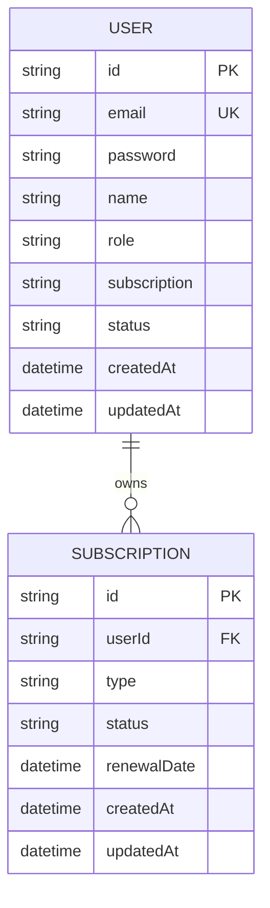

# Database Documentation 🏟️

This platform uses **PostgreSQL 16** for its durability and advanced JSON/relational support, managed by **Prisma 6**.

## 🏗️ ER Diagram (Logical)



---

## 📅 Data Models

### User Table (`User`)
- **`id`**: Unique UUID assigned at creation.
- **`email`**: The primary user identifier; must be unique across the platform.
- **`password`**: Stored as a `bcrypt` hash (never plain text).
- **`role`**: `user` or `admin`. Controls access to specific dashboard sections.
- **`subscription`**: Indicates active feature set (`free`, `pro`, `enterprise`).
- **`status`**: `active` or `inactive`. Accounts can be temporarily disabled by an Admin.

### Subscription Table (`Subscription`)
- **`userId`**: Linked to the `User` table; entries are cascade-deleted if the user is removed.
- **`type`**: The specific service tier associated with this subscription entry.
- **`renewalDate`**: Optional timestamp for trial expiration or next billing period.

---

## 🛠️ Management & Migration

1.  **Migration Registry**: All schema changes are tracked in `backend/prisma/migrations`.
2.  **Schema Source**: The source of truth is `backend/prisma/schema.prisma`.
3.  **SQL Export**: A raw SQL schema can be found in the root `db/schema.sql` for manual imports or non-Prisma environments.

### Visualization & Debugging
- To view and manage your data interactively:
  ```bash
  cd backend
  npx prisma studio
  ```
